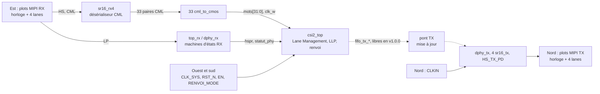

# MSPHY5973 : récepteur MIPI CSI-2 sur D-PHY 4 lanes, avec renvoi RX vers TX

Puce mixte en IHP SG13G2, pour le run Open-Silicon MPW d'octobre 2026.

Cellule de tête : `MSPHY5973`.

Chaîne de conception de ce dépôt : flot LibreLane de sg13g2_mipileo (Léo Moser).

La même puce est soumise dans IHP__MSPHY4263, avec le flot nebula (NebulaChip, nebula_toolchain).

Même brochage, mêmes blocs, mêmes connexions dans les deux dépôts.

Demande de soumission : [IHP-GmbH/Open-Silicon-MPW#71](https://github.com/IHP-GmbH/Open-Silicon-MPW/issues/71).

## État et limitations de la v1.0.0

Documents pré-remplis le 29/09/2026.

Le GDS et la netlist ne sont pas encore dans `release/v.1.0.0/`.

Ils sont poussés dès qu'ils existent, puis mis à jour à chaque étape de vérification.

- **Mode coupe (dette D37).**
  Le premier GDS part sans DRC, sans LVS, sans vérification d'antennes, sans précheck officiel IHP, sans remplissage, sans STA de la puce et sans simulation de la puce entière.
  Toutes ces étapes viennent en mise à jour de ce dépôt.
- **Die de 2 480 µm de côté, provisoire.**
  `sealring_x` et `sealring_y` suivent le die du premier GDS.
- **csi2_top ne tient pas 125,125 MHz au coin lent** (1,08 V, 125 °C).
  Setup −1,615 ns en modes de renvoi 00 à 10, soit 104,1 MHz au plus.
  Setup −3,215 ns en mode 11, soit 89,2 MHz au plus.
  Livrée ainsi par dérogation (choix 58).
  Au coin typique, la macro tient 125,125 MHz dans les quatre modes.
- **Hold de dphy_rx à −0,042 ns au coin rapide** (1,32 V, −40 °C), sur le compteur de T_HS-SETTLE (dette D36).
  Un hold négatif ne se rattrape pas en baissant la fréquence.
- **Renvoi RX vers TX non fonctionnel en v1.0.0** (dette D38).
  Le pont entre csi2_top et le TX est en cours.
  Les blocs TX sont placés et reliés aux plots, leurs commandes sont tenues inactives, les sorties `fifo_tx_*` de csi2_top restent libres.
- **Aucune sortie de csi2_top n'atteint une broche en v1.0.0.**
  Les sorties d'application restent libres, et le renvoi est inactif.
  La réception n'est donc pas observable depuis l'extérieur de la puce dans cette version.
- **PLL absente.**
  L'horloge HS du TX vient de l'extérieur, par les plots CLKIN.
- **Pas de vue Liberty** pour dphy_rx, dphy_tx, sr16_tx et sr16_rx4.
  La STA de la puce ne voit pas les chemins qui traversent ces macros.
- **Macros d'états du D-PHY antérieures aux retouches du 29/09/2026.**
  Les vues de dphy_rx et dphy_tx datent d'avant les nouvelles bornes T_HS-SETTLE et T_HS-TRAIL (MACRO.md, caelum 7ed5d558d).
- **Fonction de sr16_tx proposée, non validée** par le concepteur du D-PHY (en-tête de sr16_tx.vhd).

## Valeurs à confirmer (TBD)

- Numéros de broche QFN64, ordre des plots sur chaque côté, plan de bonding.
- Taille finale du die, donc `sealring_x` et `sealring_y` (2 480 µm provisoire).
- Tensions d'IOVDD et d'IOVDD_MIPI.
- Consommation par domaine.
- Noms définitifs des fichiers GDS et netlist dans `release/v.1.0.0/`.
- Commits exacts de dphy_rx, dphy_tx, sr16_tx et sr16_rx4 au moment de l'assemblage.
- Horloge de mot du TX et plage de fréquence de CLKIN (pont TX, prompt 065).
- Raccordement de la broche PG de dphy_rx et dphy_tx (polarisation des cellules de temporisation).
- Commandes de terminaison et de validation du récepteur HS (`term_en`, `hs_rx_en`) : MIPI_IOPadRX n'a pas d'entrée de commande à ce jour.
- Commit du PDK (22f43352) relevé sur le run de fumée du 29/09/2026 à 17:29 UTC. À confirmer sur le run qui produit le premier GDS.
- Versions des outils lues dans le shell nix de sg13g2_mipileo le 29/09/2026. À confirmer sur le run qui produit le premier GDS.
- Liste des auteurs, à valider.

## La puce

Le récepteur reçoit une liaison CSI-2 sur D-PHY : une lane d'horloge et quatre lanes de données, 1 Gbit/s par lane visé.

sr16_rx4 désérialise chaque lane en mots de 8 bits, au rythme de Wclk = HSCLK / 4.

csi2_top aligne les lanes, décode les paquets (ECC, CRC), rend les pixels et peut renvoyer le flux reçu vers le TX.

Le détail est dans [doc/Specification.md](doc/Specification.md) et [doc/Datasheet.md](doc/Datasheet.md).

## Blocs et sources

Sources dans le dépôt privé nebula_microsystems/mipi (GitLab), sauf mention.

| Bloc | Rôle | Branche et chemin | Commit |
|---|---|---|---|
| MIPI_ring | Anneau d'E/S : plots MIPI_IOPadRX, MIPI_IOPadTX, MIPI_IOPadIn, MIPI_IOPadOut, alimentations, coins, MIPI_CornerBreaker, MIPI_IOPadBandgap (bandgap et pistes de polarisation en Metal4) | ANALOG_DESIGN, `2_analog/CSI2_DPHY_RING/COLLATERALS/` | 7efada02e |
| csi2_top | Lane Management, LLP (ECC, CRC, VC, DT), pixel-byte RX et TX, contrôle de trame, renvoi RX vers TX. Macro dure, run `tapeout_s3r_t4_R1_13_d60` | claude/livraison-csi2-top, `3_digital/livraison/csi2_top/COLLATERALS/` | 78524823 |
| top_rx, dphy_rx | Machines d'états LP et HS du récepteur, sorties `hspr` et `hsreq` par lane | StateMachines (MR !7 fusionnée), caelum (MR !8 fusionnée) | 471d6dad9, a35c19710 |
| sr16_rx4 | Désérialiseur CML 4 lanes, ÷4 commun (CLK_W) | caelum, `3_digital/CML_SR/SR16_RX4/COLLATERALS/` | 7061656b8 |
| dphy_tx | Machines d'états du TX | caelum, `3_digital/DPHY_SM/COLLATERALS/` | TBD à l'assemblage |
| sr16_tx (×4) | Sérialiseur CML, une lane par instance | caelum, `3_digital/CML_SR/SR16_TX/COLLATERALS/` | TBD à l'assemblage |
| HS_TX_PD | Pré-driver d'une paire HS-TX, contre les plots MIPI_IOPadTX | ANALOG_DESIGN | 25a940756 |
| cml_to_cmos (×33) | Conversion CML vers CMOS entre sr16_rx4 et csi2_top (MOT0 à MOT31, CLK_W) | ANALOG_DESIGN, CML_LIB | fe70f9b8e |

Bibliothèques du PDK : `sg13g2_stdcell` (logique de csi2_top, des machines d'états et de HS_TX_PD).

## Brochage

Deux domaines d'E/S, séparés par des MIPI_CornerBreaker.

| Côté | Signaux | Domaine |
|---|---|---|
| Est | RX : lane d'horloge (P, N) et lanes de données 0 à 3 (P, N), alimentations IOVDD_MIPI et IOVSS_MIPI | MIPI |
| Nord | TX : lane d'horloge (P, N) et lanes de données 0 à 3 (P, N), CLKIN (P, N), plot du bandgap, alimentations | MIPI |
| Ouest et sud | CLK_SYS, RST_N, EN[3:0], RENVOI_MODE[1:0], alimentations IOVDD, IOVSS, VDD, VSS | IOVDD |

Boîtier visé : QFN64 d'IHP (Packaging.md d'Open-Silicon-MPW).

Numéros de broche et bonding : TBD.

Règle de carte : toute lane de données RX inutilisée a ses deux broches P et N reliées à la masse.

## Chaîne de conception

Le flot LibreLane (flot Chip) du dépôt sg13g2_mipileo de Léo Moser, LibreLane v3.1.0.dev3 (commit aaf7a938), dans le shell nix du dépôt.
Les macros dures sont intégrées telles que livrées.

- PDK : IHP-Open-PDK au commit 22f43352, installé par ciel dans le dépôt du flot. Ce commit porte déjà la permutation W/L des HBT de la PR #1128.
- Versions des outils : `doc/info.json`, champ `tools`.
- csi2_top est une macro dure, construite hors du run de la puce.

## Contenu du dépôt

- `doc/` : spécification, datasheet, auto-évaluation TRL, `info.json`.
- `MSPHY5973-main/` : vues de travail (layout, netlist, vérification).
- `release/v.1.0.0/` : GDS, netlist et documents livrés.
- `dependencies/` : sous-blocs, si IHP les demande à part.

## Auteurs

- Jérémy Alcim, Nebula Microsystems : Lane Management, CSI-2, intégration.
- Lionel Robert Sainte Cluque : D-PHY analogique, anneau MIPI_ring, machines d'états.
- Angel (Engeryu) : cellules CML et désérialiseurs.
- Léo Moser : flot LibreLane de sg13g2_mipileo.

## Licence

Apache-2.0.
