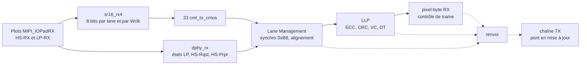

# Spécification de MSPHY5973

Version v1.0.0, pré-remplie le 29/09/2026 avant le premier GDS.

Les limitations de cette version sont en tête du [README](../README.md).

Toute valeur marquée TBD est encore inconnue.

## Fonction

MSPHY5973 est un récepteur MIPI CSI-2 sur une couche physique MIPI D-PHY, une lane d'horloge et quatre lanes de données.

Il est accompagné d'un émetteur D-PHY de même format, prévu pour renvoyer le flux reçu (renvoi RX vers TX).

La chaîne de réception va des plots jusqu'aux paquets et aux pixels.

## Blocs

| Bloc | Fonction |
|---|---|
| MIPI_IOPadRX | Plot RX d'une ligne : récepteur HS (CML) et récepteur LP |
| MIPI_IOPadTX | Plot TX d'une ligne : driver HS et driver LP |
| MIPI_IOPadBandgap | Bandgap et générateur des polarisations, distribuées par des pistes Metal4 dans l'anneau |
| sr16_rx4 | Désérialiseur CML : quatre SERDES16 et un ÷4 commun. Le mot de la lane p occupe MOT(8p+7..8p), MOT(8p) est le premier bit reçu |
| cml_to_cmos | Passage des 32 bits de mots et de CLK_W du CML au CMOS |
| dphy_rx, top_rx | Machines d'états LP de la lane d'horloge et des lanes de données, sorties `hspr` (HS-Prpr) et `hsreq` (HS-Rqst) par lane |
| csi2_top | Lane Management (recherche de la synchro 0xB8, alignement des lanes, FIFO asynchrone vers l'horloge système), LLP (ECC des en-têtes, CRC des charges, VC, DT, compteurs), pixel-byte, contrôle de trame, renvoi RX vers TX |
| dphy_tx | Machines d'états LP et HS de l'émetteur |
| sr16_tx | Sérialiseur CML 8 vers 1, une instance par lane |
| HS_TX_PD | Pré-driver d'une paire HS-TX, au plus près des plots |

## Débits

Calculés à partir des horloges de conception, non mesurés.

| Grandeur | Valeur | Origine |
|---|---|---|
| Débit HS par lane visé | 1 Gbit/s (UI = 1 ns) | Banc des machines d'états (TESTS.md de DPHY_SM) |
| Horloge HS (HSCLK) | 500 MHz, données sur les deux fronts | 2 UI par période |
| Horloge de mot Wclk | HSCLK / 4 = 125 MHz au plus | 8 bits par lane et par période de Wclk |
| Débit total, 4 lanes | 4 Gbit/s | 4 × 8 bits × 125 MHz |
| Capacité de csi2_top à 125,125 MHz | 4,004 Gbit/s | 32 bits par période de CLK_SYS |
| Capacité au coin lent, modes 00 à 10 | 3,33 Gbit/s, soit 833 Mbit/s par lane | CLK_SYS à 104,1 MHz au plus |
| Capacité au coin lent, mode 11 | 2,85 Gbit/s, soit 714 Mbit/s par lane | CLK_SYS à 89,2 MHz au plus |
| Débit minimal | TBD | |

Relations de dimensionnement :

- Débit par lane = 2 × f(HSCLK).
- f(Wclk) = f(HSCLK) / 4.
- Débit total = N × 8 × f(Wclk), avec N le nombre de lanes activées.
- Sans perte : 32 × f(CLK_SYS) ≥ N × 8 × f(Wclk).

## Horloges

| Horloge | Fréquence | Source | Rôle |
|---|---|---|---|
| CLK_SYS | 125,125 MHz (période 7,992 ns) | Broche | Horloge de csi2_top après la FIFO du Lane Management |
| Wclk (`clk_w`) | 125 MHz au plus | sr16_rx4, HSCLK / 4 | Horloge des mots reçus |
| Horloge HS reçue | 500 MHz visés | Lane d'horloge RX | Machines d'états RX, sr16_rx4 |
| CLKIN | TBD | Broches CLKIN (P, N) | Horloge HS du TX, faute de PLL |

- `clk_w` ne doit jamais battre hors HS.
- Passages entre `clk_w` et CLK_SYS : FIFO asynchrone du Lane Management et synchroniseurs à trois bascules.

## Reset

- RST_N : asynchrone, actif bas, relâché de façon synchrone dans csi2_top.

## Broches numériques

| Broche | Sens | Largeur | Rôle |
|---|---|---|---|
| CLK_SYS | entrée | 1 | Horloge système de csi2_top |
| RST_N | entrée | 1 | Reset asynchrone actif bas |
| EN[3:0] | entrée | 4 | Validation des lanes de données physiques, un bit par lane |
| RENVOI_MODE[1:0] | entrée | 2 | Mode du renvoi RX vers TX, statique |

### EN[3:0]

- EN[p] valide la lane de données physique p.
- Les lanes validées sont compactées en lanes logiques 0 à N−1, dans l'ordre croissant des lanes physiques.
- Configurations valides : N = 1, 2 ou 4 lanes.
- N = 0 et N = 3 lèvent une erreur de configuration.
- Toute lane inutilisée a ses deux broches P et N reliées à la masse sur la carte.

### RENVOI_MODE[1:0]

Statique : il ne change que sous reset.

| Mode | Nom | Ce qui repart vers le TX |
|---|---|---|
| 00 | application | Rien, le renvoi est à l'écart |
| 01 | N1, mots | Les mots du Lane Management, LLP contourné |
| 10 | N2, paquets | Les paquets du LLP, ECC et CRC refaits |
| 11 | N3, pixels | Les pixels de pixel-byte RX |

En v1.0.0, le pont vers le TX est absent : aucun mode ne produit de sortie sur les broches TX.

## Broches D-PHY

| Groupe | Broches | Plot |
|---|---|---|
| RX, lane d'horloge | RX_CLK_P, RX_CLK_N | MIPI_IOPadRX |
| RX, lanes de données | RX_D0_P, RX_D0_N à RX_D3_P, RX_D3_N | MIPI_IOPadRX |
| TX, lane d'horloge | TX_CLK_P, TX_CLK_N | MIPI_IOPadTX |
| TX, lanes de données | TX_D0_P, TX_D0_N à TX_D3_P, TX_D3_N | MIPI_IOPadTX |
| Horloge du TX | CLKIN_P, CLKIN_N | TBD |
| Bandgap | Plot de MIPI_IOPadBandgap, résistance externe de 11 kΩ (commit 9ab74c027) | MIPI_IOPadBandgap |

Les lanes sont numérotées depuis 0.

Noms de broche définitifs, numéros QFN64 et plan de bonding : TBD.

## Alimentations

| Domaine | Tension | Côtés |
|---|---|---|
| VDD, VSS (cœur) | 1,2 V nominal, coins de 1,08 V à 1,32 V | Tous |
| IOVDD_MIPI, IOVSS_MIPI | TBD | Est et nord |
| IOVDD, IOVSS | TBD | Ouest et sud |

## Conformité

Démonstrateur, pas un produit certifié.

Les timers des machines d'états sont vérifiés en simulation contre la Table 14 de la spécification D-PHY 1.1, à UI = 1 ns, aux trois coins.

Aucune conformité de la puce entière n'est revendiquée en v1.0.0.
